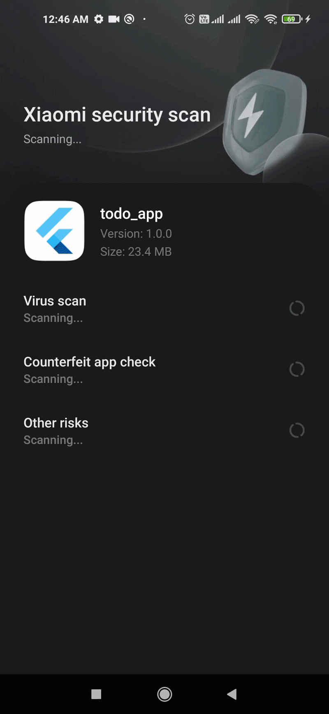
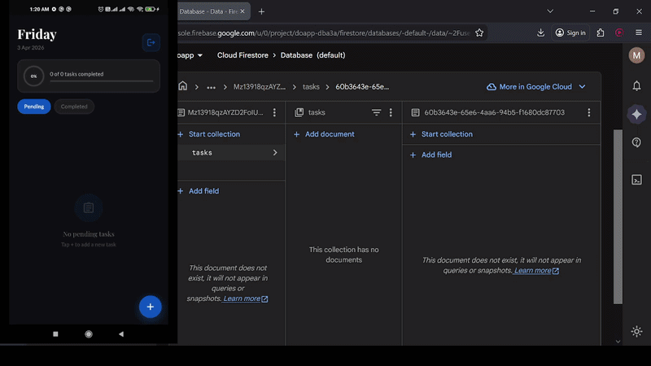

# 📝 Smart TODO | Offline-First Task Manager with Firebase Sync

A high-performance Task Management application built with **Flutter**, featuring a robust synchronization engine between **Sqflite** and **Firebase**. The app is designed to work seamlessly offline and sync data instantly once a connection is restored.

---

## 🚀 Technical Showcases (Live Demos)

### 1️⃣ Zero-to-Data (Cold Start & Sync)
*Demonstrating a 28-second flow: Installation, Authentication, and instant data restoration from the cloud via `onInit` synchronization.*

### 2️⃣ Offline-First & Cloud Propagation
*Split-screen demo: Adding a task in **Offline Mode** (Saved to Sqflite), then enabling internet to see the data automatically propagate to **Firebase Firestore**.*

---

## 🛠️ Engineering Features

* **Bidirectional Sync Engine:** Uses a `lastSync_$uid` timestamp strategy to fetch only new/updated records (Delta Sync), optimizing bandwidth and battery.
* **Persistent Local Storage:** Powered by **Sqflite** for an "always-available" user experience, even without internet.
* **Real-time Cloud Integration:** Integrated with **Firebase** for multi-device data persistence.
* **Smart Task Management:** * **Time Picker Integration:** Precise task scheduling.
    * **State Persistence:** Completed tasks are dynamically moved to the "Finished Tasks" section.
* **Clean Architecture:** Separation of concerns using **GetX** for state management and the **Repository Pattern** for data handling.

---

## 🏗️ Technical Stack

| Category | Technology |
| :--- | :--- |
| **Framework** | Flutter |
| **State Management** | GetX (Reactive) |
| **Local Database** | Sqflite |
| **Cloud Backend** | Firebase Firestore |
| **Local Cache** | GetStorage (for Sync Metadata) |
| **API/Networking** | Dio (for external resources) |

---

## 📂 Architecture Logic
The app follows a strict **Logic Flow**:
1. **Action:** User adds a task.
2. **Local First:** Task is immediately saved to `Sqflite`.
3. **Sync Check:** The `ConnectivityController` triggers a sync request.
4. **Cloud Push:** Data is pushed to Firebase with a unique User UID key.
5. **Conflict Resolution:** Implemented "Last Write Wins" (LWW) strategy to ensure data integrity.

---

## 👨‍💻 Developed By
**Mohamed Khaled** *Systems & Computer Engineer* [LinkedIn](https://www.linkedin.com/in/mohamed-khaled-ba3521241/) | [GitHub](https://github.com/mohamed151200)